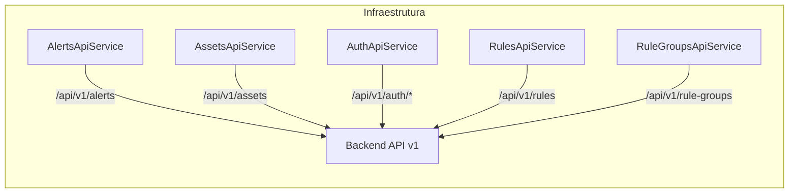

# Documento de Design - API Versioning Update

## Visao Geral

Esta feature atualiza todos os caminhos HTTP nos servicos de infraestrutura do frontend Angular para incluir o prefixo de versao `/v1/`. O backend invest-alert-api foi versionado e todos os endpoints agora seguem o padrao `/api/v1/{recurso}`. A mudanca e puramente nos caminhos das URLs - nenhuma logica de negocio, mapeamento de dados ou comportamento funcional sera alterado.

A abordagem e direta: cada servico de infraestrutura possui strings de URL hardcoded que precisam ser atualizadas de `/api/{recurso}` para `/api/v1/{recurso}`. Os testes unitarios correspondentes tambem precisam ter suas URLs de expectativa atualizadas.

## Arquitetura

A arquitetura existente segue Clean Architecture adaptada para Angular, com separacao clara entre camadas:

```
presentation -> application -> domain <- infrastructure
```

Esta mudanca afeta exclusivamente a camada de **infraestrutura** - especificamente os servicos `@Injectable` que realizam chamadas HTTP ao backend. Nenhuma outra camada e impactada.



A direcao de dependencia permanece inalterada. Os servicos continuam implementando as interfaces definidas na camada de dominio (`AlertRepository`, `AssetRepository`, `AuthRepository`, `RuleRepository`, `RuleGroupRepository`).

## Componentes e Interfaces

### Servicos Afetados

Todos os servicos estao na camada de infraestrutura de suas respectivas features. A interface publica (metodos, parametros, tipos de retorno) permanece identica. Apenas as URLs internas mudam.

| Servico | Arquivo | Caminhos Atuais | Novos Caminhos |
|---|---|---|---|
| AlertsApiService | `src/app/features/alerts/infrastructure/alerts-api.service.ts` | `/api/alerts` | `/api/v1/alerts` |
| AssetsApiService | `src/app/features/assets/infrastructure/assets-api.service.ts` | `/api/assets`, `/api/assets/{ticker}` | `/api/v1/assets`, `/api/v1/assets/{ticker}` |
| AuthApiService | `src/app/features/auth/infrastructure/auth-api.service.ts` | `/api/auth/register`, `/api/auth/login` | `/api/v1/auth/register`, `/api/v1/auth/login` |
| RulesApiService | `src/app/features/rules/infrastructure/rules-api.service.ts` | `/api/rules`, `/api/rules/{id}` | `/api/v1/rules`, `/api/v1/rules/{id}` |
| RuleGroupsApiService | `src/app/features/rules/infrastructure/rule-groups-api.service.ts` | `/api/rule-groups` | `/api/v1/rule-groups` |

### Testes Afetados

Cada servico possui um arquivo `.spec.ts` correspondente que usa `HttpTestingController.expectOne()` com URLs hardcoded. Essas URLs de expectativa precisam ser atualizadas para refletir os novos caminhos.

| Teste | Arquivo |
|---|---|
| AlertsApiService spec | `src/app/features/alerts/infrastructure/alerts-api.service.spec.ts` |
| AssetsApiService spec | `src/app/features/assets/infrastructure/assets-api.service.spec.ts` |
| AuthApiService spec | `src/app/features/auth/infrastructure/auth-api.service.spec.ts` |
| RulesApiService spec | `src/app/features/rules/infrastructure/rules-api.service.spec.ts` |
| RuleGroupsApiService spec | `src/app/features/rules/infrastructure/rule-groups-api.service.spec.ts` |

### Decisao de Design: URLs Hardcoded vs. Constante Centralizada

Duas abordagens foram consideradas:

1. **Substituicao direta das strings** (escolhida): Alterar cada ocorrencia de `/api/` para `/api/v1/` diretamente nos servicos. Mantem a simplicidade e consistencia com o padrao atual do projeto.

2. **Constante centralizada para base URL**: Extrair o prefixo `/api/v1` para uma constante compartilhada. Embora facilite futuras mudancas de versao, adiciona uma abstracao prematura para um cenario que pode nunca ocorrer. O projeto atual usa strings diretas e esta mudanca deve manter o mesmo padrao.

A abordagem 1 foi escolhida por ser a mais simples, de menor risco e consistente com o estilo existente do codebase.

## Modelos de Dados

Nenhum modelo de dados e alterado. Os tipos de request/response, interfaces de dominio e mappers permanecem identicos. A mudanca e exclusivamente nos caminhos das URLs HTTP.

## Tratamento de Erros

Nenhuma mudanca no tratamento de erros. O comportamento de erro existente (interceptors, error handlers) permanece inalterado, pois apenas os caminhos das URLs mudam. Erros HTTP (404, 500, etc.) continuam sendo tratados pelos mecanismos ja existentes.

Caso o backend nao esteja atualizado para a versao v1, as requisicoes retornarao 404 - mas isso e uma questao de deploy, nao de codigo.

## Estrategia de Testes

### Por que Property-Based Testing NAO se aplica

Esta feature envolve substituicao de strings constantes em URLs hardcoded. Nao ha:
- Funcoes puras com comportamento variavel por input
- Transformacoes de dados ou algoritmos
- Espaco de entrada amplo ou infinito
- Propriedades universais que variam com diferentes inputs

Cada criterio de aceitacao verifica uma URL especifica em um servico especifico - sao exemplos concretos, nao propriedades universais. Testes baseados em exemplos (unit tests) sao a abordagem correta e suficiente.

### Abordagem de Testes

**Testes unitarios existentes**: Os 5 arquivos `.spec.ts` ja cobrem todos os metodos de todos os servicos. A estrategia e:

1. Atualizar as URLs de expectativa nos `httpTesting.expectOne()` de `/api/{recurso}` para `/api/v1/{recurso}`
2. Executar todos os testes para confirmar que passam
3. Nenhum teste novo e necessario - a cobertura existente ja valida todos os endpoints

**Validacao final**: Executar `ng test` (ou equivalente com Vitest) para garantir que todos os testes passam apos a atualizacao, confirmando compatibilidade completa com o backend versionado.
