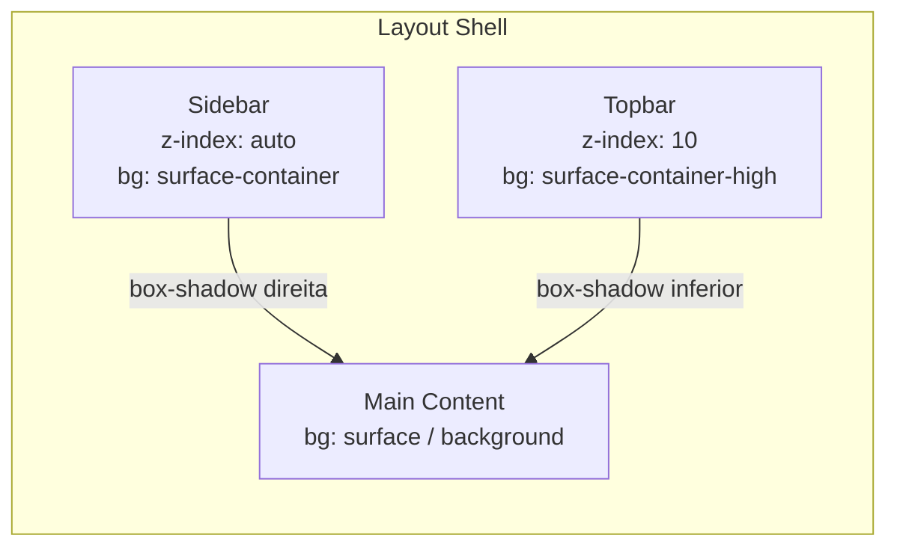

# Design Document - dashboard-visual-hierarchy

## Overview

Esta feature aplica melhorias de hierarquia visual ao layout shell da aplicação InvestAlert, tornando sidebar e topbar visualmente distintos do conteúdo principal. A abordagem é exclusivamente CSS/SCSS: nenhuma lógica TypeScript nova é necessária, pois o sistema de temas já funciona via `ThemeService` + classe `html.light-theme`, e os tokens Material M3 resolvem automaticamente as cores corretas para cada tema.

O escopo de mudança é restrito a três arquivos SCSS de componentes de layout e, se necessário, `src/styles.scss` para variáveis de fallback.

### Objetivos

- Criar separação visual clara entre sidebar, topbar e conteúdo principal via `box-shadow` e tokens de superfície M3.
- Aplicar estados visuais consistentes nos itens de navegação (hover, active) com transições suaves.
- Garantir compatibilidade total com temas claro e escuro sem nenhum valor de cor hardcoded.
- Manter acessibilidade (contraste WCAG 2.1 AA) usando os tokens M3 que já garantem esse requisito por design.

---

## Architecture

A feature não introduz novos componentes, serviços ou módulos. A arquitetura existente permanece intacta:

```
LayoutShellComponent
├── mat-sidenav (host: SidebarComponent)   ← sidebar.component.scss
└── mat-sidenav-content
    ├── TopbarComponent                     ← topbar.component.scss
    └── main.main-content                   ← layout-shell.component.scss
```

O sistema de temas opera em dois níveis:

1. **Angular Material M3** - `@include mat.all-component-themes()` em `styles.scss` define os tokens `--mat-sys-*` no escopo `html` (dark) e `html.light-theme` (light).
2. **ThemeService** - adiciona/remove a classe `html.light-theme` no `document.documentElement`. Nenhuma alteração necessária.

Os tokens CSS `--mat-sys-*` são resolvidos pelo browser automaticamente quando a classe muda, sem necessidade de JavaScript adicional.

### Diagrama de camadas visuais



---

## Components and Interfaces

### Arquivos modificados

| Arquivo | Responsabilidade |
|---|---|
| `sidebar.component.scss` | Background, box-shadow lateral, hover state, active-link indicator, tipografia dos nav items |
| `topbar.component.scss` | Background, box-shadow inferior, z-index, tipografia do app-name |
| `layout-shell.component.scss` | Altura do sidenav, garantia de que mat-sidenav herda o background correto |
| `src/styles.scss` | Variáveis CSS de fallback (apenas se necessário) |

### Tokens M3 utilizados

| Token | Uso |
|---|---|
| `--mat-sys-surface-container` | Background da sidebar |
| `--mat-sys-surface-container-high` | Background da topbar (superfície ligeiramente mais elevada) |
| `--mat-sys-surface-container-highest` | Hover state dos nav items |
| `--mat-sys-secondary-container` | Background do active-link (já existente) |
| `--mat-sys-on-secondary-container` | Cor de texto/ícone do active-link (já existente) |
| `--mat-sys-on-surface` | Cor de texto dos nav items inativos |
| `--mat-sys-on-surface-variant` | Cor de ícone dos nav items inativos |
| `--mat-sys-outline-variant` | Cor do box-shadow/separador (sutil, compatível com ambos os temas) |
| `--mat-sys-secondary` | Cor do border-left indicator do active-link |

A escolha de `--mat-sys-surface-container` para a sidebar e `--mat-sys-surface-container-high` para a topbar segue a hierarquia de elevação do Material Design 3, onde superfícies com maior elevação recebem tokens de container mais altos. Ambos pertencem à família `surface-container`, garantindo coesão visual (Requirement 5.1).

---

## Data Models

Esta feature não introduz modelos de dados. Não há estado novo, não há serviços novos, não há interfaces TypeScript novas.

---

## Correctness Properties

> Esta feature consiste exclusivamente em regras CSS/SCSS aplicadas a componentes de layout. Após análise de todos os critérios de aceitação, nenhum deles é adequado para property-based testing pelos seguintes motivos:
>
> - Todos os critérios verificam a presença de regras CSS específicas (valores de propriedades, tokens, seletores) - não há lógica computacional com espaço de entrada variável.
> - O comportamento de tema é determinístico e binário (dark/light), não se beneficia de 100+ iterações.
> - A resolução de tokens CSS é responsabilidade do browser e do Angular Material, não do código da aplicação.
>
> A estratégia de teste adequada é baseada em testes de exemplo (component tests) e inspeção de SCSS, conforme detalhado na seção Testing Strategy.

---

## Error Handling

### Token CSS indisponível

Se um token `--mat-sys-*` não estiver disponível no ambiente (ex: versão do Angular Material sem suporte completo a M3), as propriedades CSS ficarão sem valor, causando fallback para o valor inicial do browser (geralmente transparente ou herdado).

**Mitigação**: Para tokens críticos de separação visual, definir variáveis CSS de fallback em `styles.scss`:

```scss
:root {
  --layout-sidebar-bg: var(--mat-sys-surface-container, #1c1b1f);
  --layout-topbar-bg: var(--mat-sys-surface-container-high, #2b2930);
  --layout-separator-shadow: var(--mat-sys-outline-variant, rgba(0,0,0,0.12));
}

html.light-theme {
  --layout-sidebar-bg: var(--mat-sys-surface-container, #ece6f0);
  --layout-topbar-bg: var(--mat-sys-surface-container-high, #e6e0eb);
  --layout-separator-shadow: var(--mat-sys-outline-variant, rgba(0,0,0,0.08));
}
```

Os valores de fallback são os valores aproximados dos tokens M3 para as paletas violet/cyan usadas no projeto. Eles só entram em ação se o token não estiver definido.

### z-index e sobreposição

O `z-index: 10` da topbar deve ser superior ao `z-index` padrão do `mat-sidenav` em modo `over` (que usa `z-index: 4` por padrão no Angular Material). Em modo `side`, o sidenav não usa z-index elevado, então não há conflito.

**Decisão**: Topbar usa `z-index: 10`. Em modo `over`, o `mat-sidenav` overlay usa z-index gerenciado pelo CDK Overlay, que é superior a 10 por design - comportamento correto.

---

## Testing Strategy

Esta feature não é adequada para property-based testing. A estratégia de teste é baseada em testes de componente (Angular Testing Library / TestBed) e inspeção de SCSS.

### Testes de componente - SidebarComponent

**Objetivo**: Verificar que as classes e estilos corretos são aplicados nos estados esperados.

```
describe('SidebarComponent - visual hierarchy')
  it('should apply active-link class to the active route item')
  it('should render nav items with mat-list-item')
  it('should render icons and labels for each nav link')
```

> Nota: Computed styles com tokens CSS não são verificáveis via JSDOM. Os testes de componente verificam estrutura HTML e classes CSS, não valores de cor resolvidos.

### Testes de componente - TopbarComponent

```
describe('TopbarComponent - accessibility')
  it('should have aria-label on theme toggle button')
  it('should have aria-label on logout button')
  it('should have aria-label on menu toggle button (mobile)')
  it('should display app name "InvestAlert"')
```

Estes testes já existem parcialmente. O critério 7.1 (aria-labels) é verificável via `fixture.debugElement.query(By.css('[aria-label]'))`.

### Testes de componente - LayoutShellComponent

```
describe('LayoutShellComponent - responsive behavior')
  it('should set sidenav mode to "over" on mobile breakpoint')
  it('should set sidenav mode to "side" on desktop breakpoint')
  it('should close sidenav after link click in mobile mode')
```

Estes testes já existem. Nenhuma alteração necessária.

### Inspeção de SCSS (code review)

Os seguintes critérios são verificados por inspeção de código durante o code review, não por testes automatizados:

- Ausência de valores hexadecimais ou RGB hardcoded nos arquivos SCSS de layout (Requirement 6.1).
- Presença de `box-shadow` na sidebar (borda direita) e na topbar (borda inferior) usando a mesma abordagem (Requirement 5.2).
- Presença de `transition` de no máximo 200ms no hover state dos nav items (Requirement 2.3).
- Presença de `border-left` indicator no `.active-link` (Requirement 3.3).
- Uso exclusivo de tokens `--mat-sys-surface-*` para backgrounds de sidebar e topbar (Requirement 5.1).

### Teste visual manual

- Alternar entre tema claro e escuro e verificar que sidebar e topbar atualizam cores sem recarregamento.
- Redimensionar para viewport mobile e verificar que a sidebar em modo `over` exibe sombra de sobreposição.
- Verificar contraste visual do active-link em ambos os temas.

---

## Implementation Reference

Esta seção documenta as regras SCSS concretas que implementam cada requisito, servindo como referência para a fase de tasks.

### sidebar.component.scss

```scss
// Req 1.1, 1.4 - Background e altura
:host {
  display: block;
  height: 100%;
  background-color: var(--layout-sidebar-bg, var(--mat-sys-surface-container));
}

.sidebar-nav {
  padding: 8px 0;
  height: 100%;
}

// Req 2.1, 2.2, 2.3, 2.4 - Nav items: padding, tipografia, hover, espaçamento
a[mat-list-item] {
  // font-weight e font-size são controlados via matListItemTitle
  margin-bottom: 2px; // Req 2.4

  &:not(.active-link):hover {
    background-color: var(--mat-sys-surface-container-highest);
    transition: background-color 150ms ease; // Req 2.3 (< 200ms)
  }
}

[matListItemTitle] {
  font-weight: 500;   // Req 2.2
  font-size: 14px;    // Req 2.2
}

// Req 3.1, 3.2, 3.3, 3.4 - Active link
.active-link {
  background-color: var(--mat-sys-secondary-container);
  color: var(--mat-sys-on-secondary-container);
  border-left: 3px solid var(--mat-sys-secondary); // Req 3.3

  mat-icon {
    color: var(--mat-sys-on-secondary-container);
  }
}
```

### topbar.component.scss

```scss
// Req 4.1, 4.2, 4.4 - Background, sombra, z-index
.topbar {
  position: sticky;
  top: 0;
  z-index: 10; // Req 4.4 - superior ao main-content
  background-color: var(--layout-topbar-bg, var(--mat-sys-surface-container-high));
  box-shadow: 0 1px 3px rgba(0, 0, 0, 0.12), 0 1px 2px rgba(0, 0, 0, 0.08); // Req 4.2
}

// Req 7.3 - App name typography
.app-name {
  font-weight: 500;
  font-size: 1rem; // 16px
  margin-left: 8px;
}

.spacer {
  flex: 1;
}
```

> Nota sobre o box-shadow da topbar: os valores `rgba` são usados apenas para a sombra (não para cor de superfície), o que é aceitável pois sombras não fazem parte do sistema de tokens de cor M3. Alternativamente, pode-se usar `--mat-sys-shadow` se disponível na versão do Angular Material em uso.

### layout-shell.component.scss

```scss
.shell-container {
  height: 100dvh;
}

// Req 1.2 - Depth separator lateral da sidebar
// O box-shadow é aplicado no mat-sidenav pelo Angular Material em modo 'over'.
// Em modo 'side', adicionamos uma sombra sutil via override:
mat-sidenav {
  width: 240px;
  box-shadow: 2px 0 8px rgba(0, 0, 0, 0.15); // Req 1.2, 5.2
}

.main-content {
  padding: 1.5rem;
  max-width: 1200px;
  width: 100%;
  margin: 0 auto;
  box-sizing: border-box;
}
```

### styles.scss (adições)

```scss
// Layout visual hierarchy fallback tokens
:root {
  --layout-sidebar-bg: var(--mat-sys-surface-container);
  --layout-topbar-bg: var(--mat-sys-surface-container-high);
}
```

> Os fallbacks com valores hexadecimais são opcionais e só necessários se os tokens M3 não estiverem disponíveis. Dado que o projeto já usa `mat.all-component-themes()` corretamente, os tokens estarão disponíveis e as variáveis `--layout-*` servem apenas como aliases semânticos.
