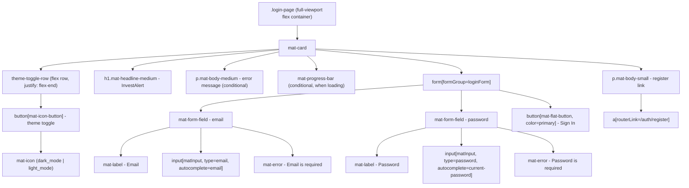

# Design Document

## Login Material Redesign

### Overview

The login screen currently uses plain HTML/CSS with hardcoded light-mode colors, making it visually inconsistent with the rest of InvestAlert. The rest of the application uses Angular Material M3 with a violet/cyan palette, Inter typography, and a dark/light theme system driven by `ThemeService`.

This redesign replaces the custom HTML/CSS login form with Angular Material components, wires in the existing `ThemeService` for a dark/light toggle, and adds the "InvestAlert" product name heading - all without introducing any new theme definitions or overriding the global M3 theme.

The scope is intentionally narrow: only `LoginPageComponent` and its template/styles are modified. No changes to routing, guards, `AuthFacade`, `ThemeService`, or any other layer are required.

---

### Architecture

The feature fits entirely within the existing Clean Architecture layers:

```
Presentation  →  LoginPageComponent  (modified)
Application   →  AuthFacade          (unchanged)
                 ThemeService        (unchanged)
Domain        →  LoginCommand        (unchanged)
Infrastructure→  AuthApiService      (unchanged)
```

`LoginPageComponent` is a standalone component. It injects `AuthFacade` (already present) and adds an injection of `ThemeService`. No new services, facades, or domain models are introduced.

The global M3 theme in `styles.scss` already emits CSS custom properties for both dark and light modes via `mat.all-component-themes($dark-theme)` and `html.light-theme { @include mat.all-component-colors($light-theme) }`. The login page inherits these automatically because it lives in the same document.

---

### Components and Interfaces

#### LoginPageComponent (modified)

**File:** `src/app/features/auth/presentation/login-page/login-page.component.ts`

Changes:
- Inject `ThemeService` alongside the existing `AuthFacade`.
- Add the following Angular Material imports directly in the component's `imports` array (no `MaterialModule` barrel):
  - `MatFormFieldModule`
  - `MatInputModule`
  - `MatButtonModule`
  - `MatIconModule`
  - `MatCardModule`
- Keep `ReactiveFormsModule` and `RouterLink`.
- Remove `LoadingIndicatorComponent` and `ErrorMessageComponent` imports (replaced by Material equivalents inline).
- Expose `themeService` as a `protected readonly` field so the template can read `themeService.isDarkMode()`.

**Template changes** (`login-page.component.html`):
- Wrap the card in a full-viewport centering container.
- Add a `<mat-card>` as the card surface.
- Add an `<h1>` with `matTypography` class `mat-headline-medium` for the "InvestAlert" heading.
- Replace each plain `<div class="form-field">` with `<mat-form-field appearance="outline">` containing `<mat-label>`, `<input matInput>`, and `<mat-error>`.
- Replace the plain submit `<button>` with `<button mat-flat-button color="primary">`.
- Add a `<button mat-icon-button>` for the theme toggle, bound to `themeService.isDarkMode()` for icon and aria-label.
- Remove the `<app-loading-indicator>` and `<app-error-message>` custom components; replace with a Material `<mat-progress-bar>` for loading and an inline `<mat-error>`-style paragraph for the API error.

**Styles changes** (`login-page.component.scss`):
- Remove all hardcoded hex colors, custom border styles, and custom button styles.
- Keep only layout rules (flexbox centering, card max-width, gap between form fields) using spacing custom properties from `styles.scss`.
- Use `var(--mat-sys-surface)` and `var(--mat-sys-on-surface)` tokens where a background or text color is needed on the container, so the page responds to theme changes automatically.

#### ThemeService (unchanged)

`ThemeService` already provides:
- `isDarkMode: Signal<boolean>` - read by the template to drive icon and aria-label.
- `toggleTheme(): void` - called by the theme toggle button click handler.
- Persistence to `localStorage` under `investalert-theme`.
- Initialization from `localStorage`, defaulting to dark.

No changes are needed.

#### AuthFacade (unchanged)

`AuthFacade` already provides:
- `loading: Signal<boolean>` - used to disable the submit button.
- `error: Signal<string | null>` - displayed as an error message.
- `login(command: LoginCommand): void` - called on form submit.

No changes are needed.

---

### Data Models

No new data models are introduced. The existing `LoginCommand` interface (`{ email: string; password: string }`) is used as-is.

The reactive form shape remains:

```typescript
loginForm = new FormGroup({
  email: new FormControl('', { nonNullable: true, validators: [Validators.required] }),
  password: new FormControl('', { nonNullable: true, validators: [Validators.required] }),
});
```

---

### Template Structure

The following Mermaid diagram shows the component tree and key element hierarchy after the redesign:



**Tab order** (requirement 5.5): The DOM order above naturally produces the required tab sequence - email field, password field, submit button, register link, theme toggle. The theme toggle is placed visually at the top-right of the card but is last in DOM order, achieved via CSS `order` or by placing it after the form in the DOM and using absolute/flex positioning.

> Design decision: placing the theme toggle last in DOM order (after the register link) satisfies the required tab order while keeping it visually in the top-right corner via `position: absolute` or flex `order`. This avoids `tabindex` manipulation.

---

### Error Handling

| Scenario | Handling |
|---|---|
| Required field empty on submit | `<mat-error>` inside `<mat-form-field>` shown when `submitted()` is true and the control has the `required` error. |
| API authentication failure | `authFacade.error()` signal is non-null; displayed as a paragraph with `color: var(--mat-sys-error)` above the form. |
| In-progress request | `authFacade.loading()` is true; submit button gets `[disabled]="authFacade.loading()"` and a `<mat-progress-bar mode="indeterminate">` is shown. |
| `localStorage` unavailable | Handled entirely by `ThemeService` (already has a try/catch); login component is unaffected. |

---

### Testing Strategy

This feature is a UI redesign of a single component. It involves DOM structure, CSS class application, and wiring of existing services. Property-based testing is not applicable here because:

- All acceptance criteria are structural DOM checks, binary state checks (dark/light), or CSS/visual requirements.
- There are no pure functions with a large input space where 100+ iterations would reveal additional bugs.
- The business logic (auth, theme persistence) lives in `AuthFacade` and `ThemeService`, which already have their own unit and property tests.

The testing strategy uses example-based unit tests only.

#### Unit Tests (`login-page.component.spec.ts`)

Each test uses `TestBed` with `provideAnimationsAsync()`, a mock `AuthFacade`, and a mock `ThemeService`.

| Test | Requirement |
|---|---|
| Renders email mat-form-field with matInput | 1.1 |
| Renders password mat-form-field with matInput | 1.2 |
| Renders submit button with mat-flat-button and color="primary" | 1.3 |
| Shows mat-error for email when form submitted empty | 1.4 |
| Shows mat-error for password when form submitted empty | 1.4 |
| Displays "InvestAlert" heading above the form | 3.1 |
| Heading has Material typography class | 3.2 |
| Theme toggle button is present | 4.1 |
| Clicking theme toggle calls ThemeService.toggleTheme() | 4.1 |
| Shows dark_mode icon when isDarkMode is true | 4.2 |
| Shows light_mode icon when isDarkMode is false | 4.2 |
| aria-label is "Switch to light mode" when isDarkMode is true | 4.3 |
| aria-label is "Switch to dark mode" when isDarkMode is false | 4.3 |
| Submit button is disabled when authFacade.loading() is true | 5.4 |
| Each mat-form-field has a mat-label | 5.1 |
| Email input has autocomplete="email" | 5.2 |
| Password input has autocomplete="current-password" | 5.2 |

#### What is NOT tested here

- Theme persistence to `localStorage` - covered by `ThemeService` tests.
- Theme initialization from `localStorage` - covered by `ThemeService` tests.
- Successful login navigation - covered by `AuthFacade` tests.
- Visual appearance, responsive layout, typography rendering - require visual regression or manual testing.
- Tab order - requires browser-level accessibility testing (e.g., axe-core or manual audit).
