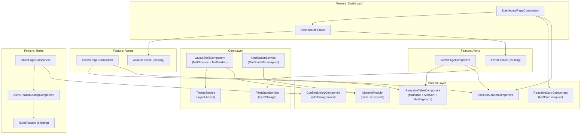

# Design Document: Material Dashboard Redesign

## Overview

This design describes the integration of Angular Material (M3) into the existing InvestAlert Angular 21 application and the redesign of the UI from a top-navbar layout to a sidebar-based Material Design interface. The redesign introduces dark/light theming, skeleton loading states, Material data tables with client-side sorting, dialog-based forms, snackbar notifications, and responsive layout - all while preserving the existing clean architecture layers, facade-based state management, and API contracts.

The approach is incremental: shared infrastructure (theme, layout shell, reusable components) is built first, then each feature page is migrated to use Material components. No API changes are required; summary statistics are computed client-side from existing endpoints.

### Key Design Decisions

1. **Angular Material M3 with custom theme** - Uses `@angular/material` v19+ with `mat.theme()` mixin and custom color palettes (blue-purple primary, teal-green tertiary). Dark mode is the default.
2. **ThemeService with signals + SSR-safe localStorage** - Uses Angular signals for reactive theme state. Guards `localStorage` access behind `isPlatformBrowser()` to avoid SSR errors.
3. **Layout shell with MatSidenav** - Replaces the current `NavbarComponent` + `LayoutComponent` with a `MatSidenav`-based shell containing a sidebar and topbar.
4. **DashboardFacade for aggregation** - A new facade that calls `AssetsApiService.list(0,1)` and `AlertsApiService.list({status}, 0, 1)` to derive summary counts from `totalElements` without a dedicated stats endpoint.
5. **Shared Material barrel module** - A `MaterialModule` that re-exports all used Material modules, keeping feature components decoupled from direct `@angular/material/*` imports.
6. **ConfirmDialog refactored to MatDialog** - The existing custom overlay `ConfirmDialogComponent` is replaced with a `MatDialog`-based implementation using `MAT_DIALOG_DATA` injection.
7. **FilterStateService with localStorage** - A generic service for persisting/restoring filter state per feature key, SSR-safe.
8. **NotificationService wrapping MatSnackBar** - Centralizes success/error notifications with consistent durations (3s success, 5s error with dismiss).
9. **SkeletonLoaderComponent with variants** - A reusable component accepting `variant: 'card' | 'table-row' | 'text'` that renders CSS-animated placeholder shapes.
10. **provideAnimationsAsync()** - Used instead of `BrowserAnimationsModule` for SSR compatibility.

## Architecture

The redesign preserves the existing layered architecture and extends it with new shared services and components.



### File Organization

```
src/app/
  core/
    layout/
      layout-shell/              # NEW - replaces layout + navbar
        layout-shell.component.ts
        layout-shell.component.html
        layout-shell.component.scss
      sidebar/                   # NEW
        sidebar.component.ts
        sidebar.component.html
        sidebar.component.scss
      topbar/                    # NEW
        topbar.component.ts
        topbar.component.html
        topbar.component.scss
    services/
      theme.service.ts           # NEW
      notification.service.ts    # NEW
      filter-state.service.ts    # NEW
  shared/
    material/
      material.module.ts         # NEW - barrel re-exports
    components/
      skeleton-loader/           # NEW
      reusable-card/             # NEW
      reusable-table/            # NEW
      confirm-dialog/            # REFACTORED to MatDialog
  features/
    dashboard/
      application/
        dashboard.facade.ts      # NEW
      presentation/
        dashboard-page/          # MODIFIED
    assets/
      presentation/
        assets-page/             # MODIFIED
        asset-detail-page/       # MODIFIED
    alerts/
      presentation/
        alerts-page/             # MODIFIED
    rules/
      presentation/
        rules-page/              # MODIFIED
        alert-creation-dialog/   # NEW
```

## Components and Interfaces

### ThemeService

```typescript
// src/app/core/services/theme.service.ts
type ThemeMode = 'dark' | 'light';

@Injectable({ providedIn: 'root' })
export class ThemeService {
  private readonly platformId = inject(PLATFORM_ID);
  private readonly document = inject(DOCUMENT);
  private readonly STORAGE_KEY = 'investalert-theme';

  readonly themeMode = signal<ThemeMode>(this.loadInitialTheme());
  readonly isDarkMode = computed(() => this.themeMode() === 'dark');

  toggleTheme(): void;           // Switches between dark/light, persists, applies CSS class
  private loadInitialTheme(): ThemeMode;  // Reads localStorage or defaults to 'dark'
  private applyTheme(mode: ThemeMode): void; // Sets/removes 'light-theme' class on <body>
}
```

The theme is applied via a CSS class on `<body>`. The Material theme SCSS uses `@media (prefers-color-scheme)` as a fallback, but the class-based toggle takes precedence. Dark mode is the default; the `light-theme` class activates the light palette.

### LayoutShellComponent

```typescript
// src/app/core/layout/layout-shell/layout-shell.component.ts
@Component({
  selector: 'app-layout-shell',
  standalone: true,
  imports: [MaterialModule, RouterOutlet, SidebarComponent, TopbarComponent],
  changeDetection: ChangeDetectionStrategy.OnPush,
})
export class LayoutShellComponent {
  readonly sidenavMode = signal<'side' | 'over'>('side');
  readonly sidenavOpened = signal(true);

  constructor() {
    // Uses BreakpointObserver to toggle sidenavMode/sidenavOpened at 768px
  }
}
```

Template structure:
```html
<mat-sidenav-container>
  <mat-sidenav [mode]="sidenavMode()" [opened]="sidenavOpened()">
    <app-sidebar (linkClicked)="onSidebarLinkClicked()" />
  </mat-sidenav>
  <mat-sidenav-content>
    <app-topbar (menuToggle)="toggleSidenav()" />
    <main role="main" class="main-content">
      <router-outlet />
    </main>
  </mat-sidenav-content>
</mat-sidenav-container>
```

### SidebarComponent

```typescript
@Component({ selector: 'app-sidebar', standalone: true, ... })
export class SidebarComponent {
  @Output() readonly linkClicked = new EventEmitter<void>();

  readonly navLinks = [
    { path: '/dashboard', label: 'Dashboard', icon: 'dashboard' },
    { path: '/assets', label: 'Assets', icon: 'trending_up' },
    { path: '/rules', label: 'Rules', icon: 'rule' },
    { path: '/alerts', label: 'Alerts', icon: 'notifications' },
  ];
}
```

### TopbarComponent

```typescript
@Component({ selector: 'app-topbar', standalone: true, ... })
export class TopbarComponent {
  @Output() readonly menuToggle = new EventEmitter<void>();
  readonly themeService = inject(ThemeService);
  readonly authFacade = inject(AuthFacade);
  readonly isMobile: Signal<boolean>; // from BreakpointObserver
}
```

### NotificationService

```typescript
@Injectable({ providedIn: 'root' })
export class NotificationService {
  private readonly snackBar = inject(MatSnackBar);

  showSuccess(message: string): void;  // duration: 3000ms
  showError(message: string): void;    // duration: 5000ms, action: 'Dismiss'
}
```

### FilterStateService

```typescript
@Injectable({ providedIn: 'root' })
export class FilterStateService {
  private readonly platformId = inject(PLATFORM_ID);

  save<T>(key: string, state: T): void;       // JSON.stringify to localStorage
  load<T>(key: string): T | null;              // JSON.parse from localStorage
  clear(key: string): void;                    // removeItem
}
```

### SkeletonLoaderComponent

```typescript
@Component({ selector: 'app-skeleton-loader', standalone: true, ... })
export class SkeletonLoaderComponent {
  @Input({ required: true }) variant: 'card' | 'table-row' | 'text' = 'text';
  @Input() count = 1;  // Number of skeleton items to render
}
```

Renders CSS-animated placeholder shapes using `@keyframes shimmer` on a gradient background. Each variant has a different shape: `card` renders a rectangle with icon circle + text lines, `table-row` renders a row of rectangular cells, `text` renders lines of varying width.

### ReusableCardComponent

```typescript
@Component({ selector: 'app-reusable-card', standalone: true, ... })
export class ReusableCardComponent {
  @Input() title = '';
  @Input() icon = '';
  @Input() elevated = false;  // Controls mat-elevation level
}
```

Template uses `<mat-card>` with `<ng-content>` for body projection.

### ReusableTableComponent

```typescript
interface ColumnConfig {
  key: string;
  header: string;
  sortable?: boolean;
  align?: 'left' | 'right' | 'center';
  cellTemplate?: TemplateRef<unknown>;
}

@Component({ selector: 'app-reusable-table', standalone: true, ... })
export class ReusableTableComponent<T> {
  @Input({ required: true }) columns: ColumnConfig[] = [];
  @Input({ required: true }) data: T[] = [];
  @Input() sortable = false;
  @Input() paginator = false;
  @Input() pageSize = 20;
  @Input() totalElements = 0;
  @Input() pageIndex = 0;
  @Input() trackByFn: TrackByFunction<T> = (index) => index;
  @Input() rowClickable = false;
  @Input() emptyIcon = 'inbox';
  @Input() emptyMessage = 'No data found.';

  @Output() readonly sortChange = new EventEmitter<Sort>();
  @Output() readonly pageChange = new EventEmitter<PageEvent>();
  @Output() readonly rowClick = new EventEmitter<T>();

  @ContentChildren(/* cell templates */) cellTemplates: QueryList<TemplateRef<unknown>>;
}
```

Wraps `MatTable`, `MatSort`, and `MatPaginator`. The `sortChange` event emits for client-side sorting. The `pageChange` event emits for server-side pagination. Custom cell rendering is supported via `ng-template` with `let-row` context.

### ConfirmDialogComponent (Refactored)

```typescript
interface ConfirmDialogData {
  title: string;
  message: string;
  confirmLabel?: string;
  cancelLabel?: string;
}

@Component({ selector: 'app-confirm-dialog', standalone: true, ... })
export class ConfirmDialogComponent {
  readonly data = inject<ConfirmDialogData>(MAT_DIALOG_DATA);
  private readonly dialogRef = inject(MatDialogRef<ConfirmDialogComponent>);

  onConfirm(): void { this.dialogRef.close(true); }
  onCancel(): void { this.dialogRef.close(false); }
}
```

Opened via `MatDialog.open(ConfirmDialogComponent, { data: {...} })`. Returns `Observable<boolean>`.

### AlertCreationDialogComponent

```typescript
interface AlertCreationDialogData {
  rule?: Rule;           // If provided, dialog is in edit mode
  ruleGroups: RuleGroup[];
}

@Component({ selector: 'app-alert-creation-dialog', standalone: true, ... })
export class AlertCreationDialogComponent {
  readonly data = inject<AlertCreationDialogData>(MAT_DIALOG_DATA);
  private readonly dialogRef = inject(MatDialogRef);
  private readonly fb = inject(FormBuilder);

  readonly form: FormGroup;
  readonly isSubmitting = signal(false);
  readonly isEditMode: boolean;

  readonly fieldOptions: RuleField[] = ['PRICE', 'DIVIDEND_YIELD', 'P_VP'];
  readonly operatorOptions: ComparisonOperator[] = [...];

  onSubmit(): void;   // Emits form data via dialogRef.close(formData)
  onCancel(): void;   // dialogRef.close(null)
}
```

### DashboardFacade

```typescript
interface DashboardState {
  readonly totalAssets: number | null;
  readonly pendingAlerts: number | null;
  readonly sentAlerts: number | null;
  readonly recentAlerts: Alert[];
  readonly isLoading: boolean;
  readonly error: string | null;
}

@Injectable({ providedIn: 'root' })
export class DashboardFacade {
  private readonly assetsApi = inject(AssetsApiService);
  private readonly alertsApi = inject(AlertsApiService);
  private readonly errorHandler = inject(ErrorHandlerService);

  private readonly state$ = new BehaviorSubject<DashboardState>(INITIAL_STATE);

  readonly totalAssets$: Observable<number | null>;
  readonly pendingAlerts$: Observable<number | null>;
  readonly sentAlerts$: Observable<number | null>;
  readonly recentAlerts$: Observable<Alert[]>;
  readonly isLoading$: Observable<boolean>;
  readonly error$: Observable<string | null>;

  loadDashboard(): void {
    // forkJoin:
    //   assetsApi.list(0, 1) -> totalElements
    //   alertsApi.list({status: 'PENDING'}, 0, 1) -> totalElements
    //   alertsApi.list({status: 'SENT'}, 0, 1) -> totalElements
    //   alertsApi.list({}, 0, 5) -> content (recent alerts)
  }
}
```

This approach makes 4 parallel API calls. The `size=1` calls are lightweight - we only need `totalElements` from the response metadata. The `size=5` call fetches the 5 most recent alerts for the list.

### MaterialModule

```typescript
// src/app/shared/material/material.module.ts
@NgModule({
  exports: [
    MatToolbarModule, MatSidenavModule, MatCardModule, MatTableModule,
    MatPaginatorModule, MatSortModule, MatFormFieldModule, MatInputModule,
    MatSelectModule, MatSnackBarModule, MatDialogModule, MatIconModule,
    MatChipsModule, MatListModule, MatProgressSpinnerModule, MatButtonModule,
  ],
})
export class MaterialModule {}
```

## Data Models

The existing domain models remain unchanged. No new domain models are introduced - the redesign is purely a presentation/infrastructure concern.

### Existing Models (Unchanged)

```typescript
// Asset - src/app/features/assets/domain/models/asset.model.ts
interface Asset {
  readonly ticker: string;
  readonly name: string;
  readonly currentPrice: number;
  readonly dividendYield: number;
  readonly pVp: number;
  readonly updatedAt: Date;
}

// Alert - src/app/features/alerts/domain/models/alert.model.ts
type AlertStatus = 'PENDING' | 'SENT';
interface Alert {
  readonly id: number;
  readonly ticker: string;
  readonly status: AlertStatus;
  readonly details: string;
  readonly createdAt: Date;
  readonly sentAt: Date | null;
}

// Rule - src/app/features/rules/domain/models/rule.model.ts
type RuleField = 'PRICE' | 'DIVIDEND_YIELD' | 'P_VP';
type ComparisonOperator = 'GREATER_THAN' | 'LESS_THAN' | 'GREATER_THAN_OR_EQUAL' | 'LESS_THAN_OR_EQUAL' | 'EQUAL';
interface Rule {
  readonly id: number;
  readonly ticker: string;
  readonly field: RuleField;
  readonly operator: ComparisonOperator;
  readonly targetValue: number;
  readonly groupId: number | null;
  readonly active: boolean;
  readonly triggered: boolean;
}

// RuleGroup - src/app/features/rules/domain/models/rule-group.model.ts
interface RuleGroup {
  readonly id: number;
  readonly ticker: string;
  readonly name: string;
  readonly rules: readonly Rule[];
}

// PageResult - src/app/shared/models/page-result.model.ts
interface PageResult<T> {
  readonly content: readonly T[];
  readonly page: number;
  readonly size: number;
  readonly totalElements: number;
  readonly totalPages: number;
}
```

### New View Models / Interfaces

```typescript
// Theme types
type ThemeMode = 'dark' | 'light';

// Column configuration for ReusableTableComponent
interface ColumnConfig {
  readonly key: string;
  readonly header: string;
  readonly sortable?: boolean;
  readonly align?: 'left' | 'right' | 'center';
}

// Dialog data interfaces
interface ConfirmDialogData {
  readonly title: string;
  readonly message: string;
  readonly confirmLabel?: string;
  readonly cancelLabel?: string;
}

interface AlertCreationDialogData {
  readonly rule?: Rule;
  readonly ruleGroups: RuleGroup[];
}

// Dashboard state
interface DashboardState {
  readonly totalAssets: number | null;
  readonly pendingAlerts: number | null;
  readonly sentAlerts: number | null;
  readonly recentAlerts: readonly Alert[];
  readonly isLoading: boolean;
  readonly error: string | null;
}

// Filter state for alerts page
interface AlertFilterState {
  readonly ticker: string;
  readonly status: string;
}
```

### Material Theme Configuration

```scss
// src/styles.scss - theme setup
@use '@angular/material' as mat;

// Custom theme with dark as default
$dark-theme: mat.define-theme((
  color: (
    theme-type: dark,
    primary: mat.$violet-palette,    // blue-purple tones
    tertiary: mat.$cyan-palette,     // teal-green tones
  ),
  typography: (
    brand-family: 'Inter, sans-serif',
    plain-family: 'Inter, sans-serif',
  ),
  density: (
    scale: 0,
  ),
));

$light-theme: mat.define-theme((
  color: (
    theme-type: light,
    primary: mat.$violet-palette,
    tertiary: mat.$cyan-palette,
  ),
  typography: (
    brand-family: 'Inter, sans-serif',
    plain-family: 'Inter, sans-serif',
  ),
  density: (
    scale: 0,
  ),
));

// Apply dark theme by default
html {
  @include mat.all-component-themes($dark-theme);
  @include mat.typography-hierarchy($dark-theme);
}

// Light theme override via class
html.light-theme {
  @include mat.all-component-colors($light-theme);
}

// Financial indicator colors (used in components)
:root {
  --color-positive: #2e7d32;
  --color-negative: #c62828;
  --color-positive-bg: rgba(46, 125, 50, 0.12);
  --color-negative-bg: rgba(198, 40, 40, 0.12);
}

html.light-theme {
  --color-positive: #2e7d32;
  --color-negative: #c62828;
  --color-positive-bg: rgba(46, 125, 50, 0.08);
  --color-negative-bg: rgba(198, 40, 40, 0.08);
}
```


## Correctness Properties

*A property is a characteristic or behavior that should hold true across all valid executions of a system - essentially, a formal statement about what the system should do. Properties serve as the bridge between human-readable specifications and machine-verifiable correctness guarantees.*

This feature is primarily a UI redesign, so most acceptance criteria are UI rendering or configuration concerns not suitable for PBT. However, several pure-logic areas benefit from property-based testing: theme toggling, serialization round-trips, client-side sorting, notification configuration, and form validation.

### Property 1: Theme toggle is self-inverse

*For any* initial theme mode (dark or light), toggling the theme twice should return the theme to its original mode.

**Validates: Requirements 3.2**

### Property 2: Theme persistence round-trip

*For any* valid ThemeMode value, persisting it via ThemeService to localStorage and then loading it back on a fresh ThemeService initialization should produce the same ThemeMode value.

**Validates: Requirements 3.3, 3.4**

### Property 3: Client-side asset sorting correctness

*For any* non-empty array of Asset objects and any valid sortable column (currentPrice, dividendYield, pVp) with any direction (asc or desc), the sorted result should be ordered such that for every consecutive pair of elements, the value in the sort column respects the specified direction.

**Validates: Requirements 6.3**

### Property 4: Filter state persistence round-trip

*For any* valid AlertFilterState object (with arbitrary ticker string and status value), saving it via FilterStateService and loading it back should produce an equivalent object.

**Validates: Requirements 7.5, 7.6**

### Property 5: Notification service configuration correctness

*For any* non-empty message string and notification type (success or error), calling the corresponding NotificationService method should open MatSnackBar with the correct duration (3000ms for success, 5000ms for error) and action (none for success, 'Dismiss' for error).

**Validates: Requirements 11.2, 11.3**

### Property 6: Alert creation form validation

*For any* combination of form field values (ticker, field, operator, targetValue, groupId), the form should be valid if and only if ticker is a non-empty string, field is one of the valid RuleField values, operator is one of the valid ComparisonOperator values, and targetValue is a number.

**Validates: Requirements 9.2**

## Error Handling

### API Error Handling Strategy

The existing `ErrorHandlerService` is preserved and extended with `NotificationService` for user-facing feedback:

1. **Facade layer** - Each facade catches `HttpErrorResponse` via RxJS `error` callback, extracts a user-friendly message via `ErrorHandlerService.extractMessage()`, and stores it in state.
2. **Presentation layer** - Components subscribe to the facade's `error$` observable. For mutation operations (create/update/delete), the component calls `NotificationService.showError(message)` to display a MatSnackBar. For read operations, the error is displayed inline or via snackbar depending on context.
3. **Success feedback** - After successful mutations, components call `NotificationService.showSuccess(message)`.

### Specific Error Scenarios

| Scenario | Handling |
|---|---|
| Dashboard summary API fails | MatSnackBar error notification; skeleton loaders remain visible |
| Assets list API fails | Inline error message via ErrorMessageComponent; skeleton loaders hidden |
| Alerts list API fails | Inline error message; skeleton loaders hidden |
| Rule create/update fails | MatSnackBar error notification; dialog remains open for correction |
| Rule delete fails | MatSnackBar error notification; confirm dialog closes |
| Theme localStorage unavailable (SSR) | Silent fallback to dark mode; no error shown |
| Filter localStorage unavailable (SSR) | Silent fallback to empty filters; no error shown |

### Form Validation Errors

- The `AlertCreationDialogComponent` uses Angular reactive forms with `Validators.required` on ticker, field, operator, and targetValue fields.
- Validation errors are displayed inline using `<mat-error>` within each `<mat-form-field>`.
- The submit button is disabled while the form is invalid or while a submission is in progress.
- The dialog does not close on validation failure - the user can correct and retry.

### Network Connectivity

- The existing `ErrorHandlerService` already handles `status === 0` (network error) with the message "Unable to connect to the server. Please check your connection."
- This message is surfaced via `NotificationService.showError()` for mutation operations.

## Testing Strategy

### Testing Framework

The project uses **Vitest** as the test runner (already configured in `package.json`). Property-based tests use **fast-check** (already a dev dependency).

### Unit Tests (Example-Based)

Unit tests cover specific scenarios, edge cases, and component rendering:

- **ThemeService**: Default to dark when no localStorage; SSR fallback to dark; applying CSS class on body
- **NotificationService**: Verify snackbar is opened with correct config (mock MatSnackBar)
- **FilterStateService**: SSR fallback returns null; clear removes key
- **DashboardFacade**: Correct aggregation of totalElements from API responses; error state on API failure
- **LayoutShellComponent**: Sidebar mode changes at 768px breakpoint; sidebar closes on mobile nav click
- **SidebarComponent**: Renders 4 nav links with correct icons and paths; active link highlighting
- **TopbarComponent**: Renders app name, logout button, theme toggle; menu button visible on mobile
- **SkeletonLoaderComponent**: Renders correct variant shapes; respects count input
- **ReusableCardComponent**: Renders title, icon, projected content
- **ReusableTableComponent**: Renders columns from config; emits sort/page/row events
- **ConfirmDialogComponent**: Returns true on confirm, false on cancel
- **AlertCreationDialogComponent**: Pre-populates in edit mode; disables submit while submitting; closes on cancel
- **DashboardPageComponent**: Shows skeleton loaders while loading; shows summary cards when loaded; shows recent alerts
- **AssetsPageComponent**: Renders MatTable with correct columns; navigates on row click; shows empty state
- **AlertsPageComponent**: Renders filter controls; restores filters from localStorage; shows status chips
- **RulesPageComponent**: Opens dialog on create/edit; opens confirm dialog on delete; shows snackbar on success/error

### Property-Based Tests

Each property test runs a minimum of 100 iterations using fast-check. Tests are tagged with the feature name and property number.

| Property | Test Description | Generator Strategy |
|---|---|---|
| Property 1: Theme toggle self-inverse | Generate random initial ThemeMode, toggle twice, assert equality | `fc.constantFrom('dark', 'light')` |
| Property 2: Theme persistence round-trip | Generate random ThemeMode, save to mock localStorage, create new service instance, assert loaded value matches | `fc.constantFrom('dark', 'light')` with mock localStorage |
| Property 3: Client-side sorting | Generate arrays of Asset objects with random numeric values, sort by random column/direction, verify ordering invariant | `fc.array(fc.record({...}))` with `fc.constantFrom('currentPrice', 'dividendYield', 'pVp')` and `fc.constantFrom('asc', 'desc')` |
| Property 4: Filter state round-trip | Generate random AlertFilterState with arbitrary strings, save and load, assert deep equality | `fc.record({ ticker: fc.string(), status: fc.constantFrom('', 'PENDING', 'SENT') })` |
| Property 5: Notification config | Generate random message strings and notification types, verify snackbar config matches expected values | `fc.string({ minLength: 1 })` with `fc.constantFrom('success', 'error')` |
| Property 6: Form validation | Generate random combinations of field values (some valid, some empty/null), assert form validity matches expected predicate | `fc.record({...})` with mix of valid and invalid values |

### Tag Format

Each property test includes a comment tag:
```
// Feature: material-dashboard-redesign, Property {N}: {property_text}
```

### Integration Tests

- SSR rendering produces valid HTML without Material-related errors
- Full layout renders with sidebar, topbar, and routed content
- Navigation between feature routes works with lazy loading

### What Is NOT Tested via PBT

- UI rendering and layout (component tests with examples instead)
- CSS styling, spacing, elevation, typography (visual review)
- Accessibility (manual testing with assistive technologies + automated a11y audits)
- Animation behavior (visual review)
- Angular Material's own behavior (already tested by the library)
